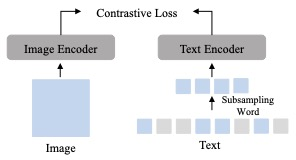

# SW-CLIP: Subsampling of Frequent Words in Text for Pre-training a Vision-Language Model
ACM MM 2023 Workshop Paper Code: Subsampling of Frequent Words in Text for Pre-training a Vision-Language Model.




## Data
We use the [CC3M](https://github.com/rom1504/img2dataset/blob/main/dataset_examples/cc3m.md) dataset for training.
Then, you can generate the sub-sampling file by ```python3 src/data/subsampling.py```.

## Train the model
Train our model on SLURM: ```sbatch clip_run_experiment_cluster_das_train.sh```.

```
torchrun --nproc_per_node=8 --master_port=25678 training/main.py \
  --save-frequency=1 \
  --report-to=tensorboard \
  --train-data="./path/to/cc3m_train.csv" \
  --imagenet-val="./path/to/imagenet_validation" \
  --csv-img-key=image \
  --csv-caption-key=caption \
  --model=RN50 \
  --batch-size=256 \
  --lr=1e-3 \
  --wd=0.1 \
  --epochs=30 \
  --workers=8 \
  --seed=42 \
  --local-loss \
  --gather-with-grad \
  --force-custom-text \
  --subsample \
  --name pretrain_cc3m_train_RN50_subsample
```
## Fine-tune the model
Fine-tune our model without subsamlping frequent words on SLURM : ```sbatch clip_run_experiment_cluster_das_finetune.sh```.

``` 
torchrun --nproc_per_node=8 --master_port=25698 training/main.py \
  --save-frequency=1 \
  --report-to=tensorboard \
  --zeroshot-frequency=1 \
  --train-data="../path/to/cc3m/cc3m_train.csv" \
  --imagenet-val="./path/to/imagenet_validation" \
  --csv-img-key=image \
  --csv-caption-key=caption \
  --model=RN50 \
  --pretrained="./path/to/checkpoints/epoch_K.pt" \
  --batch-size=768 \
  --warmup=125 \
  --lr=1e-3 \
  --wd=0.1 \
  --epochs=1 \
  --workers=8 \
  --seed=42 \
  --local-loss \
  --gather-with-grad \
  --force-custom-text \
  --name pretrain_cc3m_train_RN50_subsample_finetune
```

## Evaluation
Test our model on SLURM.
```sbatch ml_run_with_slurm_das_test.sh```

We upload our pre-trained model [here](). You can download them and put them into the model directory.
Test the model by: ```sbatch clip_run_experiment_cluster_das_test.sh```

```
python -u training/main.py \
  --report-to tensorboard \
  --imagenet-val="./path/to/imagenet_validation/" \
  --csv-img-key=image \
  --csv-caption-key=caption \
  --batch-size=256 \
  --workers=6 \
  --model=RN50 \
  --pretrained="./path/to/checkpoints/epoch_K.pt" \
  --seed=42 \
  --local-loss \
  --gather-with-grad \
  --force-custom-text
```


## Citation
<pre>
</pre>


We borrow the code from ["open_clip"](https://github.com/mlfoundations/open_clip.git)

